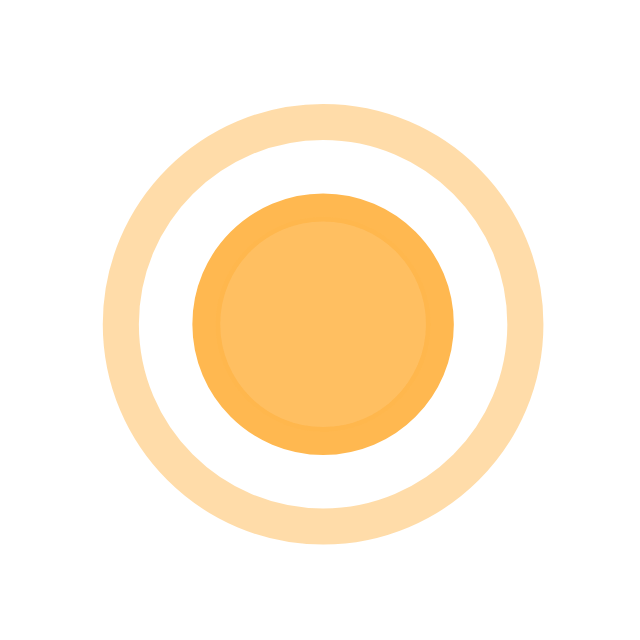

<div align="center">



# RippleEffect

**A lightweight, Kotlin-first ripple background view for Android.**

Pick a color, drop it behind any view, and get smooth expanding ripples in a
built-in shape (circle, star, arrow, diamond, moon) — or in the **exact shape
of the view you point them at**.

[](LICENSE)
[](https://jitpack.io/#ripple-effect/RippleEffect)
[](https://android-arsenal.com/api?level=21)
[](#performance)
[](https://github.com/ripple-effect/RippleEffect/actions/workflows/build.yml)

</div>

---

## Why

- 5 built-in shapes + auto **match-view** mode (Button, FAB, Card, Avatar…)
- Single `ValueAnimator` drives N ripples — no child views, no per-frame allocations
- Pure Kotlin, fluent property API, also callable from Java
- **Zero runtime dependencies**, **~19 KB release AAR**, `minSdk` 21
- Lifecycle-safe — auto-stops on detach, resumes on re-attach

---

## Install

Add JitPack to your root `settings.gradle.kts`:

```kotlin
dependencyResolutionManagement {
    repositories {
        google()
        mavenCentral()
        maven(url = "https://jitpack.io")
    }
}
```

Then in your module:

```kotlin
dependencies {
    implementation("com.github.ripple.effect:ripple:1.0.0")
}
```

> If you fork this project, the JitPack coordinate becomes
> `com.github.<your-github-username>:RippleEffect:<tag>`. To use the literal
> `com.github.ripple.effect:ripple` group you'll need Maven Central or a
> self-hosted Maven repo.

Prefer vendoring? `include(":ripple")` then `implementation(project(":ripple"))`.

---

## Quick start

**XML**

```xml
<com.github.ripple.effect.RippleBackgroundView
    xmlns:android="http://schemas.android.com/apk/res/android"
    xmlns:app="http://schemas.android.com/apk/res-auto"
    android:layout_width="match_parent"
    android:layout_height="match_parent"
    app:rb_color="#0099CC"
    app:rb_radius="32dp"
    app:rb_rippleAmount="4"
    app:rb_duration="3000"
    app:rb_scale="6"
    app:rb_shape="star"
    app:rb_autoStart="true">

    <ImageView
        android:layout_width="64dp"
        android:layout_height="64dp"
        android:layout_gravity="center"
        android:src="@drawable/my_logo" />

</com.github.ripple.effect.RippleBackgroundView>
```

**Kotlin**

```kotlin
val ripple = findViewById<RippleBackgroundView>(R.id.ripple)
ripple.rippleShape    = RippleBackgroundView.Shape.STAR
ripple.rippleColor    = 0xFF0099CC.toInt()
ripple.rippleAmount   = 5
ripple.rippleDuration = 2_500L
ripple.start()
```

Java callers use the equivalent `setRippleShape(...)`, `setRippleColor(...)`, etc.

---

## Match the shape of any view

Point the ripple at a real `View` and it adopts that view's outline — round-rect
for Material buttons, circle for avatars, oval for chips, rect for image views.

```kotlin
findViewById<MaterialButton>(R.id.cta).addRippleEffect {
    rippleColor    = Color.MAGENTA
    rippleAmount   = 5
    rippleDuration = 2_200
}
```

`addRippleEffect` wraps the target in a `RippleBackgroundView`, derives its
shape, disables clipping on the parent, and starts animating. The static
`RippleBackgroundView.attach(view)` is the Java-friendly equivalent and is
idempotent (calling it twice returns the same wrapper).

In XML, use `app:rb_shape="matchView"` and place the target as the only child —
the wrapper auto-detects its shape on the first layout pass and re-detects
whenever the child's bounds change.

### Override the corner radius

Take control of the ripple corner radius via `matchViewCornerRadius` (or
`app:rb_matchViewCornerRadius`), in **pixels**:

| Value | Result |
|---|---|
| `< 0` (`AUTO`, default) | Follow the source view's natural shape |
| `0` | Force sharp rectangular ripples |
| `< halfMin` | Round-rect with that exact corner radius |
| `>= halfMin` | Promotes to a perfect oval / circle |

```kotlin
ripple.matchViewCornerRadius = RippleBackgroundView.MATCH_VIEW_CORNER_RADIUS_AUTO
```

---

## XML attributes

| Attribute | Type | Default | Description |
|---|---|---|---|
| `rb_color` | color | `#FF0099CC` | Ripple color |
| `rb_radius` | dimension | `64dp` | Base radius (ignored in `matchView`) |
| `rb_rippleAmount` | int | `4` | Concurrent ripples |
| `rb_duration` | int | `3000` | Cycle duration, ms |
| `rb_scale` | float | `6` | Final scale factor |
| `rb_type` | enum | `fillRipple` | `fillRipple` or `strokeRipple` |
| `rb_strokeWidth` | dimension | `2dp` | Stroke width when `type=strokeRipple` |
| `rb_shape` | enum | `circle` | `circle`, `star`, `arrow`, `diamond`, `moon`, `matchView` |
| `rb_matchViewCornerRadius` | dimension | `auto` | Corner-radius override in `matchView` mode |
| `rb_starPoints` | int | `5` | Number of star points (≥ 3) |
| `rb_starInnerRatio` | float | `0.45` | Star inner/outer ratio (0..1) |
| `rb_shapeRotation` | float | `0` | Degrees of rotation per ripple |
| `rb_startAlpha` | float | `1.0` | Alpha at progress 0 |
| `rb_endAlpha` | float | `0.0` | Alpha at progress 1 |
| `rb_autoStart` | bool | `false` | Start animating on attach |
| `rb_interpolator` | reference | accelerate-decelerate | Per-ripple curve |

Every attribute is also a Kotlin `var` on `RippleBackgroundView`.

---

## Public API — `com.github.ripple.effect.RippleBackgroundView`

| Member | Notes |
|---|---|
| `rippleColor: Int` | `@ColorInt` |
| `rippleRadius: Float`, `rippleScale: Float`, `rippleAmount: Int`, `rippleDuration: Long` | Mutable at runtime |
| `rippleType: Type` | `FILL`, `STROKE` |
| `rippleShape: Shape` | `CIRCLE`, `STAR`, `ARROW`, `DIAMOND`, `MOON`, `MATCH_VIEW` |
| `sourceView: View?` | Setting it switches to `MATCH_VIEW` and centers ripples on the view |
| `matchViewCornerRadius: Float` | px override; `MATCH_VIEW_CORNER_RADIUS_AUTO` (`-1f`) follows the source |
| `starPoints`, `starInnerRatio`, `shapeRotation`, `startAlpha`, `endAlpha`, `strokeWidth`, `rippleInterpolator`, `autoStart` | Clamped to valid ranges |
| `isRunning: Boolean`, `start()`, `stop()` | `start()` is idempotent |

---

## Performance

- **One `ValueAnimator` for N ripples** via phase offsets
- **No child views per ripple** — drawn directly on the view's canvas
- **Cached unit paths** built once, transformed each frame with a reused `Matrix`
- **Circle fast path** uses `canvas.drawCircle` — no path allocation per frame
- **Smart invalidation** — `invalidate()` only fires while animating
- **Leak-safe** — `onDetachedFromWindow` always cancels the animator

---

## Contributing

PRs welcome — see [CONTRIBUTING.md](CONTRIBUTING.md). House rules:

- No new runtime dependencies in `:ripple`
- `minSdk` stays at 21
- No allocations in `onDraw`
- New property → new `app:rb_*` attr → row in the table → `CHANGELOG.md` entry

---

## License

[MIT](LICENSE) © 2026 RippleEffect contributors
